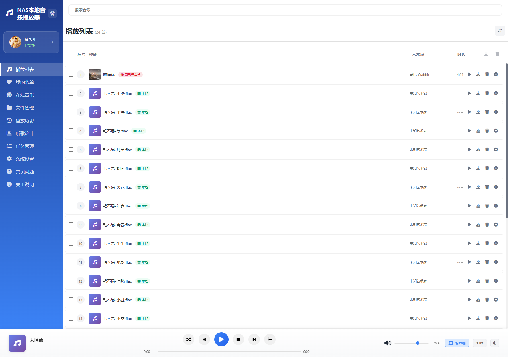
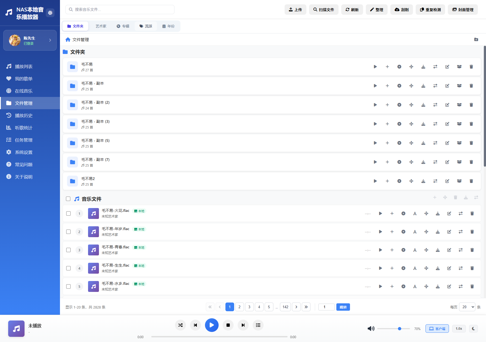
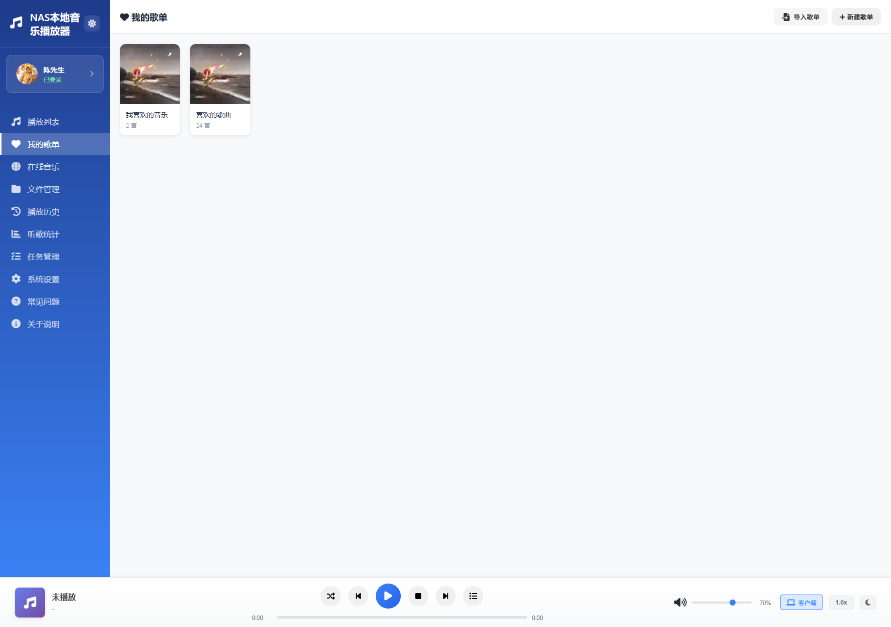
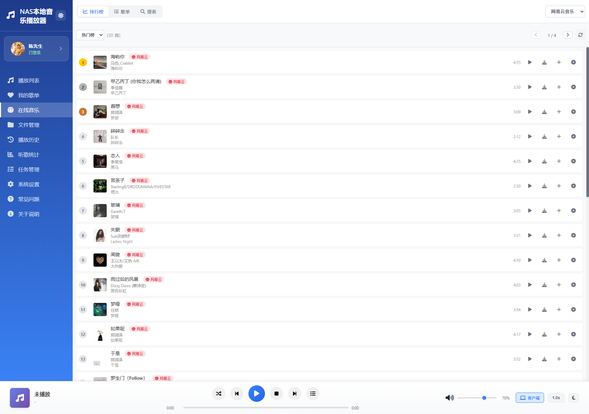
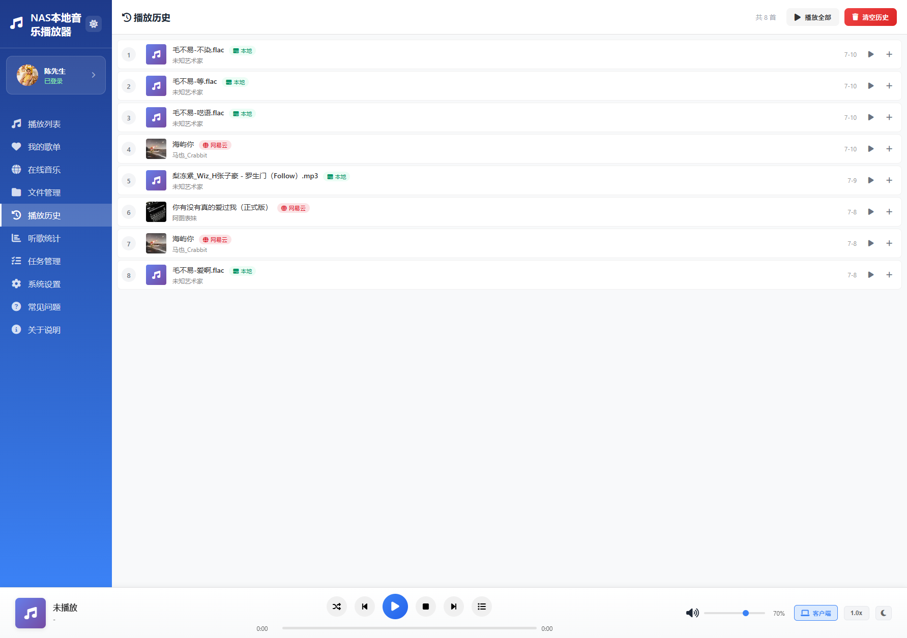
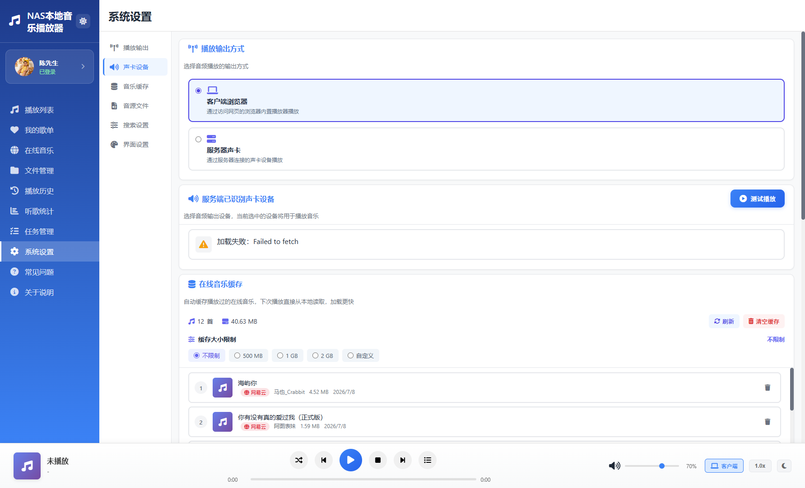

# NAS本地音乐播放器

一个轻量级的本地音乐播放器，支持通过网页界面控制 NAS 服务器播放音乐。通过插入 AUX 音频线或 USB 声卡设备，即可实现音乐播放。同时支持客户端模式，直接在浏览器中播放音乐。

---

## 界面预览

### 主播放界面


### 文件管理


### 我的歌单


### 在线音乐


### 播放历史


### 系统设置


---

## 功能特性

### 🎵 播放控制
- 播放 / 暂停 / 停止
- 上一首 / 下一首
- 4种播放模式：顺序播放、随机播放、单曲播放、单曲循环
- 音量调节 / 静音
- 进度条拖拽定位
- **播放速度调节**：0.5x ~ 2.0x 共 6 档速度（仅客户端模式）
- **歌曲间淡入淡出**：音量平滑过渡，可开关和调节时长（1-10秒）
- **睡眠定时器**：10/20/30/60/90 分钟定时停止播放
- **均衡器/音效调节**：8 种预设音效 + 10 段自定义均衡器（仅客户端模式）
- **快捷键支持**：空格（播放/暂停）、方向键（快进/快退/音量）、N/P（切歌）、M（静音）、L（收藏）、F（大播放界面）

### 📁 音乐管理
- 支持格式：MP3、FLAC、WAV、M4A、OGG、WMA
- 自动扫描 `music/` 目录
- **文件夹视图**：树状目录浏览，新建/重命名/移动/删除文件夹
- **分类浏览**：按艺术家、专辑、流派、年份分组展示
- **批量操作**：批量上传、移动、删除、下载、格式转换
- **重复文件检测**：按歌名+歌手/文件名/文件大小三种方式检测，一键清理
- **专辑封面管理**：自动识别嵌入封面和文件夹封面，统一管理
- **歌曲丢失检测**：自动检测歌单中丢失的文件，支持重新匹配

### 📃 歌单管理
- 创建/编辑/删除歌单
- 歌单导入/导出（JSON / M3U 格式）
- **我喜欢的音乐**：一键收藏，自动置顶
- 歌单封面自动获取（歌单内第一首歌的封面）
- 丢失歌曲自动检测与清理
- 丢失歌曲一键匹配（综合评分算法）

### 🔍 在线音乐
- 多平台音乐搜索（网易云、QQ音乐、酷我、酷狗、咪咕等）
- 在线歌单/排行榜浏览
- 在线试听（客户端模式）
- **下载到本地**：直接下载到浏览器端
- **下载到服务器**：后台任务队列下载，可配置并发数
- 音源文件管理（JS 格式，支持上传/启用/禁用）
- 在线音乐缓存，播放过的自动缓存本地

### 📊 播放历史与统计
- **播放历史**：自动记录最近 200 首，支持清空
- **听歌统计**：今日/本周/本月/全部四个维度
  - 播放次数、听歌时长
  - 最爱歌曲、最爱歌手
  - 常听歌曲 Top 10、常听歌手 Top 10

### 🔊 声卡管理
- 自动检测系统声卡设备
- 支持选择不同的音频输出设备
- 跨平台支持（Windows / macOS / Linux / Docker）
- 声卡测试功能

### 🎨 界面体验
- **主题切换**：浅色模式 / 深色模式 / 跟随系统
- **响应式设计**：适配桌面端和移动端
- 封面悬停预览（300x300 放大图）
- 歌曲来源标签（本地/各平台主题色）
- 列表序号统一圆角矩形样式
- 所有操作按钮深灰色统一风格

### 🔐 用户系统
- 密码登录，首次使用设置密码
- 登录有效期 7 天，支持记住密码
- 权限控制：未登录仅可浏览和播放，管理操作需登录

### 🛠️ 系统功能
- 支持 ZIP 包热更新
- 配置文件持久化
- 多客户端状态同步
- **任务管理**：统一管理转换、上传、下载任务
  - 后台队列处理，可配置并发数
  - 实时进度显示
  - 任务删除/清理

---

## 播放模式

| 模式 | 说明 |
|------|------|
| `sequence` | 顺序播放，播完自动下一首 |
| `random` | 随机播放 |
| `single` | 单曲播放，播完停止 |
| `loop` | 单曲循环 |

---

## 技术架构

| 组件 | 技术 |
|------|------|
| 后端 | Express.js (Node.js) |
| 前端 | 原生 HTML / CSS / JavaScript |
| 服务端播放 | ffplay / afplay / aplay |
| 客户端播放 | HTML5 Audio API |
| 元数据解析 | music-metadata |
| 音频处理 | fluent-ffmpeg |
| 容器化 | Docker (Alpine) |

---

## 依赖库说明

| 依赖库 | 版本 | 用途 |
|--------|------|------|
| express | ^4.18.2 | Web 框架，提供 HTTP 服务和 API 路由 |
| adm-zip | ^0.5.10 | ZIP 文件解压缩，支持系统热更新功能 |
| ffmetadata | ^1.7.0 | 使用 FFmpeg 读写音频文件元数据 |
| fluent-ffmpeg | ^2.1.3 | FFmpeg 的 Node.js 封装，用于音频处理和格式转换 |
| iconv-lite | ^0.7.2 | 字符编码转换，解决中文文件名和标签乱码问题 |
| mp3-parser | ^0.3.0 | MP3 文件底层解析，获取音频帧信息 |
| multer | ^1.4.5-lts.1 | 处理 multipart/form-data 文件上传 |
| music-metadata | ^8.1.3 | 音频文件元数据解析，支持多种格式（MP3/FLAC/M4A等） |
| node-id3 | ^0.2.9 | 读写 MP3 文件的 ID3 标签信息 |
| jsonwebtoken | - | JWT 认证，用户登录鉴权 |

---

## 快速开始

### 本地运行

```bash
# 安装依赖
npm install

# 启动服务
node server.js
```

访问地址：`http://localhost:9524`

### Docker 部署

```bash
docker-compose up -d
```

### Windows 一键启动

双击运行 `start.bat`

---

## 目录结构

```
NAS本地音乐播放器/
├── server.js              # 后端服务核心逻辑
├── config.json            # 用户配置文件
├── version.json           # 版本信息
├── music/                 # 音乐文件存放目录
├── data/                  # 数据目录（歌单、缓存、认证等）
├── public/                # 前端资源
│   ├── index.html         # 主页面
│   ├── app.js             # 前端逻辑
│   └── style.css          # 样式文件
├── Dockerfile             # Docker 镜像配置
├── docker-compose.yml     # 容器编排配置
├── package.json           # 项目依赖
├── release.ps1            # 自动发布脚本
├── start.bat              # Windows 启动脚本
├── install-ffmpeg.ps1     # Windows FFmpeg 安装脚本
├── generate-favicon.js    # 网站图标生成脚本
├── DOCKER_AUDIO.md        # Docker 音频配置说明
├── CHANGELOG.md           # 更新日志
└── README.md              # 项目说明
```

---

## API 接口

### 播放控制

| 接口 | 方法 | 功能 |
|------|------|------|
| `/api/playlist` | GET | 获取播放列表 |
| `/api/play/:index` | GET | 播放指定歌曲 |
| `/api/pause` | GET | 暂停播放 |
| `/api/resume` | GET | 继续播放 |
| `/api/stop` | GET | 停止播放 |
| `/api/next` | GET | 播放下一首 |
| `/api/previous` | GET | 播放上一首 |
| `/api/status` | GET | 获取播放状态 |
| `/api/play-mode` | GET/POST | 获取/设置播放模式 |
| `/api/volume` | GET/POST | 获取/设置音量 |

### 音乐管理

| 接口 | 方法 | 功能 |
|------|------|------|
| `/api/upload-music` | POST | 上传音乐文件 |
| `/api/refresh` | GET | 刷新音乐库 |
| `/api/download/:index` | GET | 下载音乐文件 |
| `/api/delete/:index` | DELETE | 删除音乐文件 |
| `/api/folders` | GET | 获取文件夹列表 |
| `/api/cover` | GET | 获取音乐封面 |

### 声卡管理

| 接口 | 方法 | 功能 |
|------|------|------|
| `/api/audio-devices` | GET | 获取声卡列表 |
| `/api/audio-device` | POST | 选择声卡设备 |

### 用户认证

| 接口 | 方法 | 功能 |
|------|------|------|
| `/api/login` | POST | 用户登录 |
| `/api/user-info` | GET | 获取用户信息 |
| `/api/set-password` | POST | 设置密码 |

### 系统功能

| 接口 | 方法 | 功能 |
|------|------|------|
| `/api/system-update` | POST | 系统更新 |
| `/api/tasks` | GET | 获取任务列表 |
| `/api/worker-config` | GET/POST | 获取/设置并发配置 |

---

## 多平台音频播放

| 平台 | 播放器 | 说明 |
|------|--------|------|
| Windows | ffplay | 需安装 ffmpeg |
| macOS | afplay | 系统自带 |
| Linux | aplay | ALSA 工具 |
| Docker | ffmpeg → aplay | 管道转发音频 |

---

## 配置说明

配置文件 `config.json` 位于项目根目录：

```json
{
    "playMode": "random",
    "volume": 80,
    "theme": "auto",
    "clientPlayback": false
}
```

主要配置项：
- `playMode`：播放模式（sequence/random/single/loop）
- `volume`：默认音量（0-100）
- `theme`：主题模式（light/dark/auto）
- `clientPlayback`：是否启用客户端播放模式

---

## Docker 部署说明

### 前提条件

1. 宿主机已安装 Docker 和 Docker Compose
2. NAS 支持 Docker 运行

### 部署步骤

1. 修改 `docker-compose.yml` 中的卷挂载路径，指向 NAS 上的音乐文件夹
2. 运行打包脚本或手动构建镜像
3. 启动容器

### 音频配置

Docker 环境下音频通过以下方式工作：

1. ffmpeg 解码音频文件
2. 通过管道将 PCM 数据传递给 aplay
3. aplay 输出到 ALSA 声卡设备

详细说明请参阅 `DOCKER_AUDIO.md`。

---

## 更新日志

详见 `CHANGELOG.md`

---

## 许可证

MIT License

---

© 2026 RONGLINC93. All Rights Reserved.
